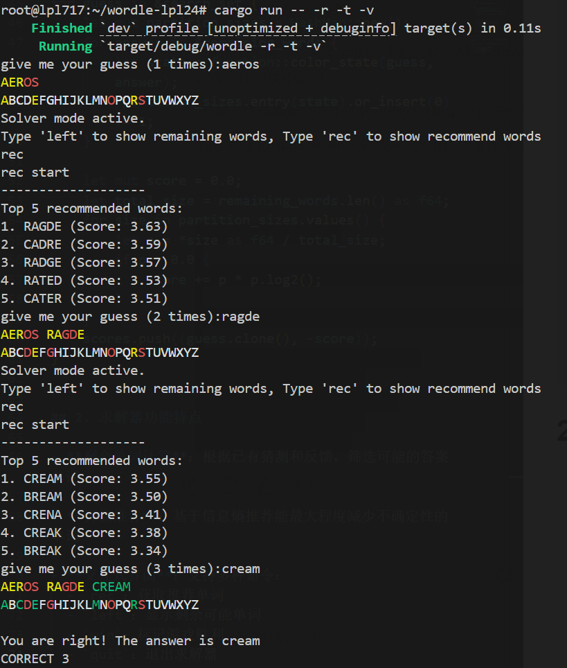

# Wordle-with-Rust
# Wordle游戏项目报告

## 程序结构说明

本项目是一个基于Rust语言实现的Wordle猜词游戏，包含以下主要模块：

### 主要文件结构
- `main.rs`：程序入口点，处理命令行参数和游戏主循环
- `function.rs`：核心游戏逻辑和功能实现
- `solver.rs`：附加的求解器功能，提供游戏辅助
- `builtin_words.rs`：内置单词列表（未展示内容）

### 架构概述
程序采用模块化设计，将游戏逻辑(`function.rs`)、主程序流程(`main.rs`)和求解器功能(`solver.rs`)分离，提高了代码的可维护性和可读性。游戏状态使用Serde库进行序列化和反序列化，支持游戏的持久化。

## 游戏主要功能说明

### 1. 基本游戏玩法
- 玩家有6次机会猜测一个5字母单词
- 每次猜测后，系统会给出颜色反馈：
  - 绿色(G)：字母正确且位置正确
  - 黄色(Y)：字母正确但位置错误
  - 红色(R)：字母不存在于目标单词中

### 2. 特色功能
- **多种游戏模式**：支持随机模式、指定单词模式和每日挑战模式
- **难度选择**：困难模式增加了猜测限制，必须使用已揭示的提示信息
- **数据持久化**：游戏状态可保存到文件，支持继续游戏
- **统计功能**：记录游戏数据并显示胜率、平均尝试次数等统计信息
- **自定义词集**：支持使用外部词集文件进行游戏

### 3. 游戏界面示例

*游戏运行界面，显示猜测历史、颜色反馈和键盘状态*


## 求解器功能实现（附加功能）

### 1. 求解器算法设计
求解器采用基于信息熵的单词推荐算法：

```rust
for guess in &search_set {
    let mut partition_sizes = HashMap::new();
    for answer in &remaining_words {
        let state = function::color_state(guess, answer);
        *partition_sizes.entry(state).or_insert(0) += 1;
    }
    
    let mut score = 0.0;
    let total_size = remaining_words.len() as f64;
    for size in partition_sizes.values() {
        let p = *size as f64 / total_size;
        if p > 0.0 {
            score += p * p.log2(); 
        }
    }
    scores.push((guess.clone(), -score));
}
```

## 2. 求解器功能特点

- **剩余单词计算**：根据已有猜测和反馈，筛选可能的答案单词

- **智能推荐**：基于信息熵推荐能最大程度减少不确定性的单词

- **交互式界面**：支持多种命令：
  - `rec`：获取推荐单词
  - `left`：显示剩余可能单词
  - `win`：标记游戏胜利
  - `quit`：退出求解器
 
## Usage

To run the program, use the following command structure:

```sh
cargo run -- [OPTIONS]
-w	--word <WORD>	Specifies the answer word for a single game. This disables the interactive answer prompt and statistics tracking after the game ends.
-r	--random	Starts the game in random mode. The program will select a new random answer for each game from the final word set. This flag is incompatible with --word.
-D	--difficult	Enables difficult mode. Subsequent guesses must reuse green letters in the correct position and yellow letters in any position.
-t	--stats	After each game, displays your overall win/loss record, average guesses for successful games, and the five most frequently used guess words. This option requires that game state is either persistent via --state or tracked for the current session.
-d	--day <NUM>	(Random Mode Only) Specifies the starting day for the random word sequence, effectively skipping the first NUM-1 games. Default is 1. This is incompatible with --word.
-s	--seed <NUM>	(Random Mode Only) Specifies a u64 seed for the random word generator. The seed ensures that the sequence of random words is repeatable. This is incompatible with --word.
-f	--final-set <PATH>	Specifies a custom file containing the list of possible answer words. The file should be a newline-separated list of 5-letter words.
-a	--acceptable-set <PATH>	Specifies a custom file containing the list of all acceptable guess words. The file should be a newline-separated list of 5-letter words.
-S	--state <PATH>	Saves and loads the game history and statistics to a JSON file. If the file exists, the program loads the state; otherwise, a new file is created.
-c	--config <PATH>	Specifies a JSON configuration file to load default options from. Command-line arguments will override any settings found in the file.

-v start solver to support
-so start only solver
